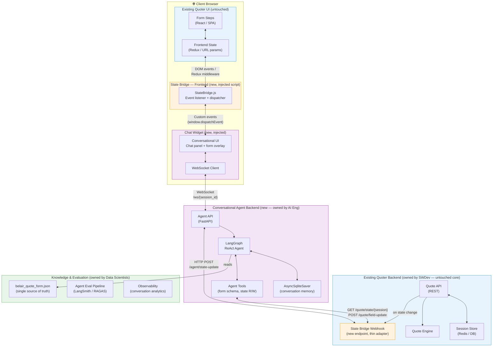
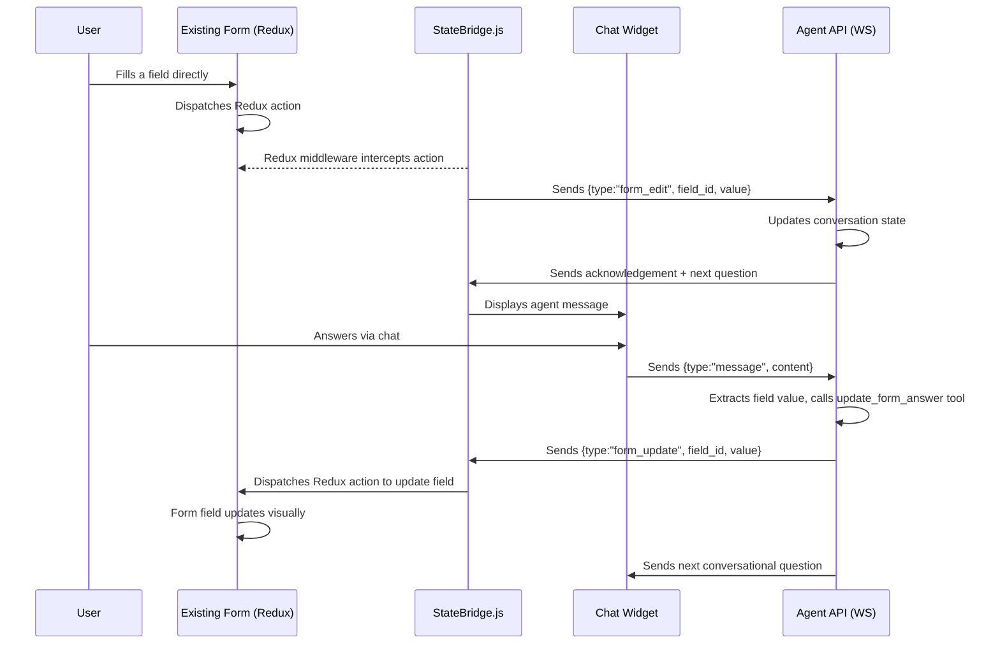
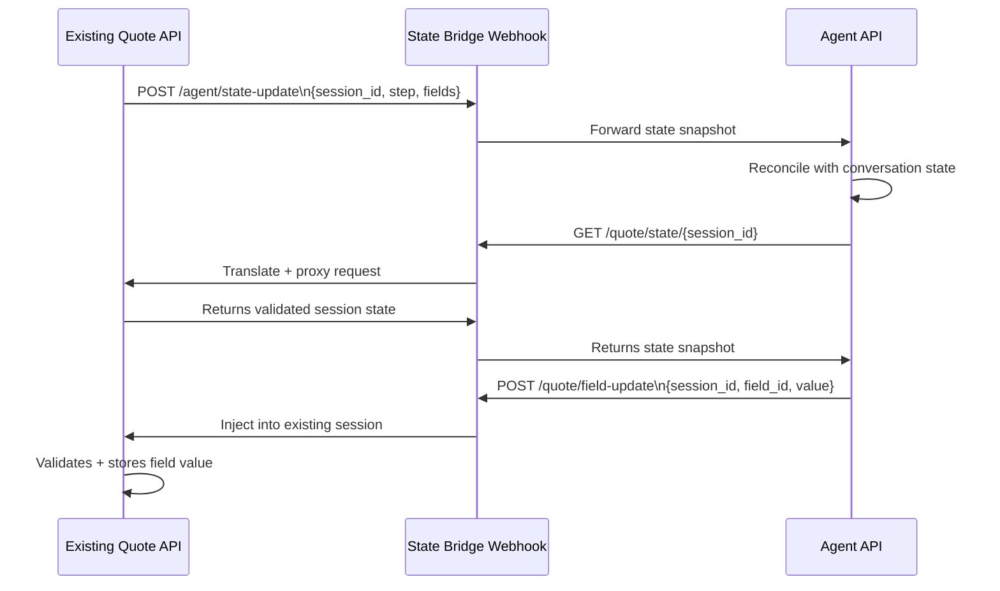
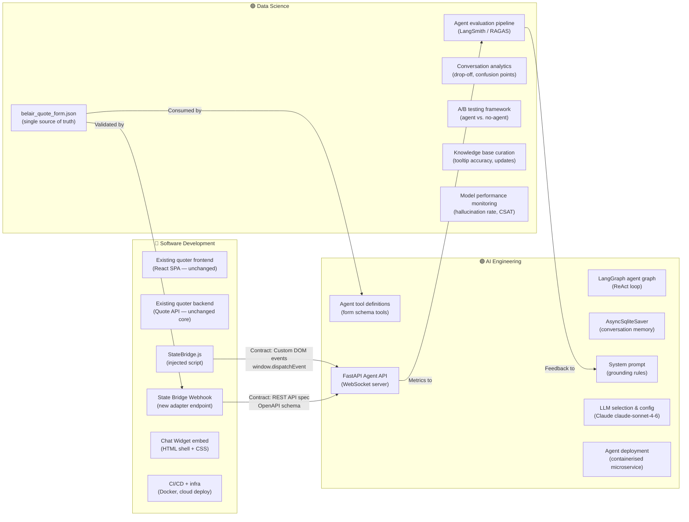
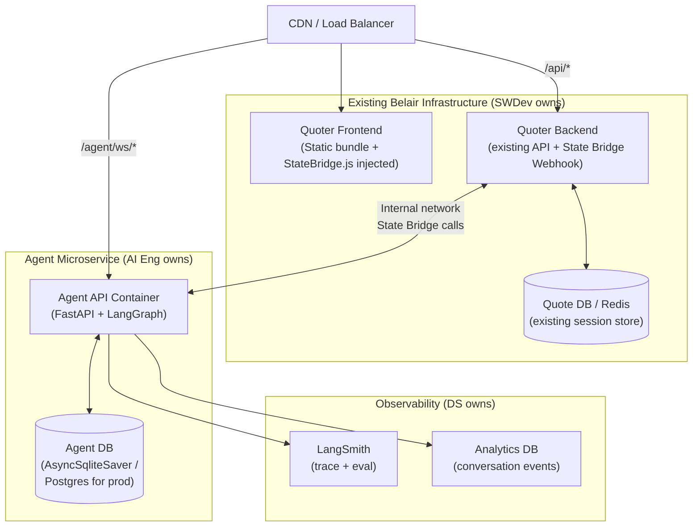

# Architecture: Conversational Layer on Belair Direct Online Quoter

## 1. The Core Problem

The existing Belair Direct online quoter is a live production system. The conversational agent must be added **without modifying the existing quoter's core logic**. The two systems need to share form state in real time, bidirectionally:

- When a user answers via chat → the existing quoter's form fields must update
- When a user fills the form directly → the agent must be notified and stay in sync

The integration point is the **State Bridge** — a thin, framework-agnostic layer that decouples the two systems and is owned by the Software Development team.

---

## 2. High-Level Architecture



---

## 3. The State Bridge — How State Is Intercepted

The existing quoter passes state between frontend and backend via:
- **URL routing** (`/quote/car/1/info`, `/quote/car/1/vehicle`, etc.) — step is encoded in the URL
- **Session cookies** — the backend holds validated field values server-side
- **REST calls** — the frontend POSTs field values to the backend on each step completion

The State Bridge intercepts at **two points** without touching the existing code:

### 3a. Frontend State Bridge (injected `<script>`)



**Implementation — `StateBridge.js`** (injected as a `<script>` tag by SWDev):
```javascript
// StateBridge.js — owned by Software Development team
// Injected into the existing quoter page. Zero changes to existing code.

class StateBridge {
  constructor() {
    this.ws = null;
    this.sessionId = this._getOrCreateSession();
    this._injectChatWidget();
    this._hookIntoRedux();       // or MutationObserver if Redux not accessible
    this._listenToURLChanges();  // detect step transitions
    this._connectWebSocket();
  }

  _hookIntoRedux() {
    // Approach A — if Redux DevTools extension is present (dev/staging):
    window.__REDUX_DEVTOOLS_EXTENSION__?.connect()?.subscribe(state => {
      this._onFormStateChange(state);
    });

    // Approach B — wrap window.fetch to intercept form POST calls (production):
    const originalFetch = window.fetch;
    window.fetch = async (url, options) => {
      const response = await originalFetch(url, options);
      if (url.includes('/quote/') && options?.method === 'POST') {
        const body = JSON.parse(options.body || '{}');
        this._onFormStateChange(body);  // broadcast to agent
      }
      return response;
    };
  }

  _listenToURLChanges() {
    // Detect step transitions from URL changes
    window.addEventListener('popstate', () => {
      const step = this._extractStepFromURL(window.location.pathname);
      this.ws?.send(JSON.stringify({ type: 'step_change', step }));
    });
  }

  _onFormStateChange(fields) {
    // Send updated fields to agent via WebSocket
    this.ws?.send(JSON.stringify({ type: 'form_edit_batch', fields }));
  }

  applyAgentUpdate(fieldId, value) {
    // Agent has determined a value — push it into the existing form
    // Dispatch a custom event the existing React app listens to
    window.dispatchEvent(new CustomEvent('agent:field-update', {
      detail: { fieldId, value }
    }));
  }
}
```

### 3b. Backend State Bridge (thin webhook adapter — new endpoint on existing server)



The webhook adapter is a **thin translation layer** — it maps the agent's field schema (`belair_quote_form.json` field IDs) to the existing backend's internal field names. This is the only place where the two schemas are coupled.

---

## 4. Team Ownership Map



---

## 5. Team Responsibilities — Clear Boundaries

### 🔵 Software Development

| Responsibility | Details |
|---|---|
| **State Bridge Webhook** | New endpoint on the existing backend. Exposes `GET /agent/state/{session_id}` and `POST /agent/field-update`. Owns the field-name mapping between internal schema and `belair_quote_form.json` IDs |
| **StateBridge.js** | Injected script that hooks into the existing frontend's event system. Owned by SWDev — AI Eng never touches the existing frontend |
| **Chat Widget shell** | The HTML/CSS container for the chat panel. Can be a floating overlay or split-panel. AI Eng provides the WebSocket URL; SWDev handles the embed |
| **Session correlation** | Links the existing quoter's `sessionId` (cookie-based) to the agent's `thread_id`. SWDev provides this mapping in the State Bridge Webhook headers |
| **Security & auth** | Existing auth/CSRF tokens are forwarded by the webhook. Agent API is internal-only (not public-facing) |
| **Deployment** | Deploys the agent container alongside the existing infrastructure. Manages routing rules (nginx / API gateway) |

### 🟣 AI Engineering

| Responsibility | Details |
|---|---|
| **LangGraph graph** | Owns `agent/graph.py` — the ReAct loop, node definitions, checkpointer wiring |
| **Agent tools** | Owns `agent/tools.py` — reads `belair_quote_form.json` (provided by DS), reads/writes state via the State Bridge Webhook (spec provided by SWDev) |
| **System prompt** | Owns the grounding rules, scope constraints, tone, and workflow instructions |
| **Agent API** | Owns `main.py` (FastAPI server) — WebSocket protocol, session management, error handling |
| **LLM config** | Model selection, temperature, token budgets, streaming vs. batch |
| **Conversation memory** | `AsyncSqliteSaver` strategy — what to persist, TTL, compaction |
| **Tool contract consumption** | Consumes the OpenAPI spec provided by SWDev for the State Bridge Webhook |

### 🟢 Data Science

| Responsibility | Details |
|---|---|
| **`belair_quote_form.json`** | Single source of truth for all questions, order, field types, options, and tooltip text. DS owns updates when Belair changes the form |
| **Agent evaluation** | Runs automated evals (LangSmith) to catch regressions when the system prompt or tools change. Defines pass/fail criteria |
| **Conversation analytics** | Tracks where users drop off, which questions cause confusion, which agent responses lead to form completion |
| **Hallucination monitoring** | Flags any agent responses that contain content not traceable to `belair_quote_form.json` |
| **A/B testing** | Measures quote completion rate with vs. without the agent. Owns the experiment framework |
| **Knowledge base** | If RAG is added in future, DS builds and maintains the vector store over Belair policy documents |

---

## 6. State Synchronisation Contract (the API between teams)

This is the **explicit contract** SWDev exposes for AI Eng to consume. It is the only coupling point between the two systems.

### State Bridge Webhook — OpenAPI (SWDev delivers this)

```yaml
# SWDev implements, AI Eng consumes
paths:

  /agent/state/{session_id}:
    get:
      summary: Get current validated form state for a session
      parameters:
        - name: session_id
          in: path
          required: true
          schema:
            type: string
      responses:
        '200':
          content:
            application/json:
              schema:
                type: object
                properties:
                  session_id:   { type: string }
                  current_step: { type: integer }
                  fields:
                    type: object
                    additionalProperties:
                      type: string
                    example:
                      vehicle_year: "2022"
                      vehicle_make: "Toyota"
                      vehicle_model: "RAV4"

  /agent/field-update:
    post:
      summary: Agent pushes a field value into the existing quoter session
      requestBody:
        content:
          application/json:
            schema:
              type: object
              required: [session_id, field_id, value]
              properties:
                session_id: { type: string }
                field_id:   { type: string }   # matches belair_quote_form.json id
                value:      { type: string }
      responses:
        '200':
          content:
            application/json:
              schema:
                type: object
                properties:
                  accepted:         { type: boolean }
                  validation_error: { type: string, nullable: true }

  /agent/state-update:           # called BY existing backend, TO agent
    post:
      summary: Existing backend notifies agent of a state change
      requestBody:
        content:
          application/json:
            schema:
              type: object
              properties:
                session_id:   { type: string }
                current_step: { type: integer }
                fields:       { type: object }
```

### WebSocket Protocol — (AI Eng delivers this, SWDev's StateBridge.js consumes)

```
Client (StateBridge.js) → Agent API
  { "type": "message",        "content": "My car is a 2022 Toyota" }
  { "type": "form_edit",      "field_id": "vehicle_year", "value": "2022" }
  { "type": "form_edit_batch","fields": {"vehicle_year":"2022","vehicle_make":"Toyota"} }
  { "type": "step_change",    "step": 2 }

Agent API → Client (StateBridge.js)
  { "type": "message",    "message": { "role": "assistant", "content": "..." }, "form_state": {...} }
  { "type": "form_update","field_id": "vehicle_year", "value": "2022" }   ← agent pushes to form
  { "type": "init",       "message": {...}, "form_state": {...} }
  { "type": "error",      "detail": "..." }
```

---

## 7. Deployment Architecture



**Routing rule** (nginx / API gateway — SWDev adds one rule):
```nginx
# All agent WebSocket traffic → agent container
location /agent/ws/ {
    proxy_pass         http://agent-service:8000/ws/;
    proxy_http_version 1.1;
    proxy_set_header   Upgrade $http_upgrade;
    proxy_set_header   Connection "upgrade";
}
# State Bridge webhook — internal only
location /agent/state {
    proxy_pass http://agent-service:8000;
    allow 10.0.0.0/8;   # internal only
    deny  all;
}
```

---

## 8. Phased Delivery Plan

| Phase | What ships | Who delivers |
|-------|-----------|-------------|
| **Phase 0** | `belair_quote_form.json` finalised and versioned | Data Science |
| **Phase 1** | State Bridge Webhook (GET/POST endpoints + OpenAPI spec) | Software Dev |
| **Phase 2** | Agent API + LangGraph tools wired to State Bridge | AI Engineering |
| **Phase 3** | `StateBridge.js` + Chat Widget injected into quoter | Software Dev + AI Eng |
| **Phase 4** | Eval pipeline live, A/B test launched | Data Science |
| **Phase 5** | Production hardening: Postgres checkpointer, Redis pub/sub for scale | All teams |

---

## 9. Key Design Decisions

| Decision | Rationale |
|----------|-----------|
| **Agent as a separate microservice** | Zero risk to existing quoter. Can be rolled back independently. |
| **StateBridge.js as injected script** | No changes to existing frontend codebase. SWDev injects one `<script>` tag. |
| **Fetch interception for state capture** | Works regardless of frontend framework (React, Angular, Next.js). Falls back to MutationObserver on form elements if needed. |
| **`belair_quote_form.json` as shared contract** | DS owns the form truth. Both the agent tools and the State Bridge Webhook field mapping reference the same file. |
| **Session ID correlation via cookie forwarding** | The existing session cookie is forwarded in the WebSocket handshake headers. SWDev maps it to a `thread_id` in the State Bridge Webhook. |
| **Agent never calls the Quote Engine directly** | Agent only reads/writes fields. Validation and quoting remain inside the existing backend. Clean boundary. |
